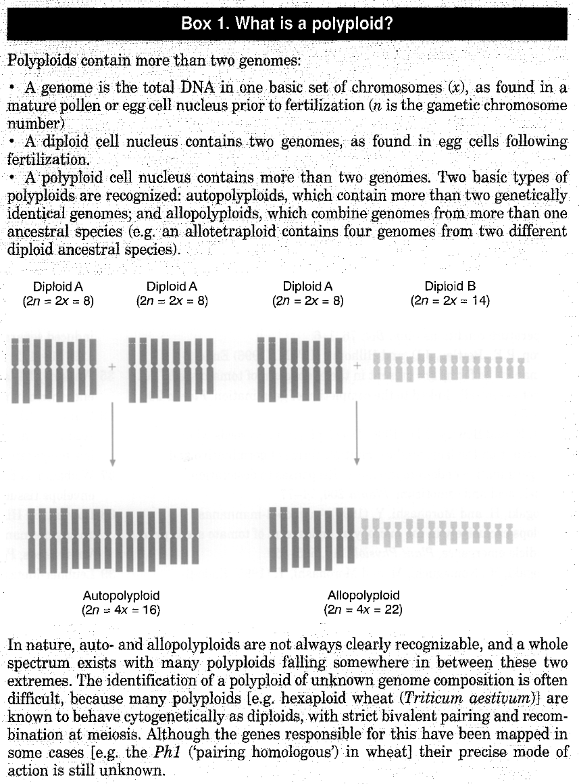
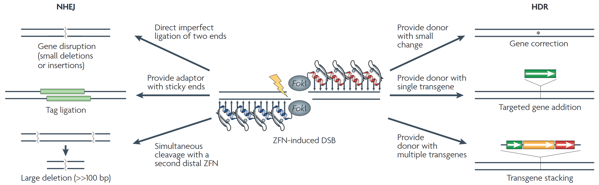

\clearpage
# Background
## Polyploidy {#sec:polyploidy}
All modern angiosperms have undergone at least one kind of genome duplication event in their evolutionary history, if not multiple cycles of polyploidization [@Wendel.GenomeEvolutionPolyploids.2000]. However, not all polyploidization events are the same. They are conventionally divided into two kinds: autopolyploidy and allopolyploidy, which refer to the doubling of a species's own genome, and the summation of two genomes via hybridization, respectively [@Kihara.ChromosomenzahlenUndSystematische.1926]. Duplicate chromosomes with the same genes and overall structure (as in diploids and recent cases of autopolyploidy) are called *homologous pairs*, while those that have begun to diverge (but are still recognizably related) are called *homoeologous pairs* [@Lyons.HowUsefullyCompare.2008; @Spies.MismatchRepairHomologous.2015; @Glover.HomoeologsWhatAre.2016]. For a more visual explanation of polyploidy and its various forms, see [@Fig:box1], reprinted from the excellent review article by @Leitch.PolyploidyAngiosperms.1997.

Overall, polyploidy is "recognized as a major force in plant evolution, affecting diversification and speciation" [@WeissSchneeweiss.EvolutionaryConsequencesConstraints.2013], but it can be a roadblock to traditional crop improvement programs [@Laurie.WheatMaizeHybrid.1986; @Mason.CreatingNewInterspecific.2015; @Soares.MeiosisPolyploidsImplications.2021], so there exists significant interest in novel methods to drive crop improvement. In this paper, historical and current methods and techniques for manipulating the plant genome are discussed, and particular attention is paid to how polyploidy does (or does not) complicate the operation.

{#fig:box1 height=6in}

{#fig:ZFN width=6in}

## Mutagenesis Technologies {#sec:mutagens}
Many different technologies have been developed for genome manipulation. The following subsections give a brief overview of the four most prominent options. They are presented roughly in order of earliest to most recent development, which coincidentally also arranges them roughly in order of least to most precisely targeted.

### Untargeted Mutagenesis
The simplest methods of mutagenesis are those that cause untargeted, random mutations in the target organism. These generally work by causing small breaks in embryonic DNA, which are repaired (with errors) by endogenous mechanisms. The two most common processes used to cause this are irradiation---historically with X-rays but now mostly with gamma rays---and exposure to chemicals such as ethyl methane sulfonate (EMS) [@Micke.InducedMutationsCrop.1990; @Davey.InducedMutagenesisPlants.2010]. However, this method requires preparing huge numbers of mutated offspring so that the desired mutations can be screened from that population, which is a rather labor-intensive task [@Freisleben.UeberDieAuffindung.1942; @Nicolia.TargetedGeneMutation.2015], even if it is slightly easier in the present era of high-throughput genomics [@Collard.MarkerAssistedSelection.2008].

### Direct Gene Transfer
While the above physical and chemical mutagens are random and cannot be guided, there exist several newer technologies that allow more directed genetic changes. The simplest method is called direct gene transfer (DGT), and it simply functions by inserting foreign DNA fragments into target cells [@Gasser.GeneticallyEngineeringPlants.1989]. Many different variations on this method exist: stimuli like heat shock or electroporation can be applied to plant protoplasts in order to encourage uptake from surrounding solution, chemical mediators like polyethylene glycol (PEG) can be used to make the cell membrane permeable to naked DNA, biolistic "gene guns" or microscopic needles can be used to physically inject the DNA fragments into target cells, or DNA fragments can even be placed into artificial liposomes for endocytosis by the plant cell membrane [@Potrykus.DirectGeneTransfer.1987; @Johnson.DirectGeneTransfer.1989; @Lacroix.BiolisticApproachTransient.2020].

### *Agrobacterium*-mediated Transformation ("Agroinfiltration")
One of the most influential early discoveries in the field of directed mutagenesis was that of *Agrobacterium tumefaciens*-mediated gene transfer by @Chilton.StableIncorporationPlasmid.1977. This landmark study showed that a particular pathogen caused tumors by a then-novel mechanism---transferring some of its own genes into its host, which were then integrated into the host plant's genome. The cellular machinery of *Agrobacterium* that produces this effect primarily comes from one large plasmid, which has two sections: the DNA segment to be transferred, called T-DNA, and a set of virulence (or *vir*) genes, which cause the T-DNA to be inserted into the host genome but are not supposed to be integrated themselves.

Once that structure was understood, it was relatively straightforward for a genetic engineer to replace the tumor-causing T-DNA on that plasmid with the gene they want to transform into the target plant instead [@Gasser.GeneticallyEngineeringPlants.1989]. For a notable example, the "SALK lines" of sequence-indexed *Arabidopsis* mutants [@Alonso.GenomeWideInsertional.2003] were created by using a non-coding sequence of T-DNA: when inserted into a gene, that gene is knocked out.

That said, another very important use of this system [@Schmitz.CrisprTranslocationAgrobacterium.2020] and others like it [@Yin.GeminivirusBasedGuide.2015] is to deliver other mutagens, as it is an effective way to smuggle foreign materials into mature plant cells. However, this method is limited to plants that are susceptible to the original pathogen.

### Site-Specific Nuclease Technologies
The newest and most precise method for targeted mutagenesis uses a specialized endonuclease, such as zinc-finger nucleases (ZFNs), transcription activator-like effector nucleases (TALENs), or a system of clustered regulatory interspaced short palindromic repeats (CRISPR) and associated (Cas) protein, in order to induce a DNA double-strand break (DSB) at a specific location in the target genome. The organism can then be induced to repair the break in one of two primary ways: either via the sloppy non-homologous end joining (NHEJ) process, which is often used to knock out genes with a small frameshift mutation, or via homology-directed repair (HDR), which can alter or insert genes near the DSB [@Urnov.GenomeEditingEngineered.2010]. The common uses and outcomes of these technologies are summarized in [@Fig:ZFN]. The core technology underpinning this family of methods "is based on the use of engineered nucleases composed of sequence-specific DNA-binding domains fused to a nonspecific DNA cleavage module" [@Gaj.ZfnTalenCrispr.2013], and the fact that the site-specificity is decoupled from the DNA cleavage functionality means that these methods are easy to adapt for nearly any target gene.

Note that CRISPR/Cas methods have largely replaced both ZFN- and TALEN-based methods in recent years, as they are generally cheaper and simpler while still being of comparable or superior precision and reliability for most applications. However, there are still niche cases where the older technologies are a better choice, so CRISPR/Cas is not an unqualified upgrade [@Budhagatapalli.SimpleTestCleavage.2016; @Shamshirgaran.ToolsEfficientGenome.2022].

# Polyploidy & Genetic Engineering
As discussed in [@sec:polyploidy], polyploid organisms often hold more than just one or two alleles for a given gene, as they can have multiple homologous or homoeologous pairs of chromosomes. This can pose a challenge for modifying the genome in many cases [@Mason.OilseedRapeLearning.2016], as is discussed below.

## Backcrossing in Highly Heterozygous Species {#sec:hetero}
Many of the most elite crop varieties are highly heterozygous, painstakingly cultivated over many generations of crosses with carefully selected parent and donor plants in order to combine all the desired alleles into one cultivar. In order to prevent the accumulated traits from segregating out of the offspring, these lines are propagated by vegetative cloning instead of conventional breeding [@Udall.PolyploidyCropImprovement.2006; @Schaart.GenomeEditingPolyploid.2021].

Therefore, bringing a new allele into the elite variety is no simple task: first, the parent plant must be crossed with a new donor plant in order to make a hybrid. Then, the crop improvers must backcross the hybrid progeny with the elite donors or their own parent lines multiple times, which can take many seasons; for polyploid varieties---as most commercial crops are---this workload is multiplied several-fold, as there are that many more alleles to put into one line [@Ahmad.TargetedGenomeEditing.2023]. This exhaustive process is necessary to ensure that only the new allele is incorporated into the finely-tuned genome of the elite line, preventing any unwanted genes from tagging along in the process. However, diligently following the best practices is still not a guarantee of success: unlucky breeders may find their new line suffering from so-called "yield drag", as their backcrosses fail to eliminate some unwanted genes and have a decreased yield compared to the original elite line [@Dhugga.GeneEditingAccelerate.2022].

Because it is so laborious to work new genes into existing crop varieties, there is great interest in using targeted mutagenesis technologies to directly introduce new alleles into elite crops in a much more direct and predictable fashion. Of those discussed in [@sec:mutagens], some methods hold more promise than others.

### Untargeted Mutagenesis
Fully random mutagens like radiation or EMS are the least effective for this sort of work. Since they are completely untargeted, they are much more likely to disrupt the carefully maintained genotype of the elite cultivar than they are to introduce a beneficial allele with absolutely no other changes. In general, these methods are now primarily used to generate large libraries of mutants for basic research, though some of those mutants may still be used as donors for traditional crosses if they are characterized as having a desirable allele [@Nicolia.TargetedGeneMutation.2015; @Tarakanov.WhatIsMutation.2022].

### Direct Gene Transfer
DGT can be used to insert new genes into elite cultivars, but there are limitations to the technology that often make it less desirable than newer methods. The greatest downside of DGT is that almost all methods for getting foreign DNA into the target plant cells require them to first be converted to protoplasts by removing or digesting their cell wall. For the plant tissues that are amenable to this treatment, it is not an issue for most *in vitro* research, but many plant species cannot be regenerated into mature plants from protoplast-derived clones, so it is of limited use for developing agriculturally useful crops [@Potrykus.DirectGeneTransfer.1987; @Lacroix.BiolisticApproachTransient.2020].

The other main limitation of DGT is that, even for plant tissues suitable for protoplast preparation, it is not very precise. Naked DNA plasmids "routinely undergo rearrangement and concatenation reactions before insertion and can lead to chromosomal rearrangements during insertion" into target cells [@Gasser.GeneticallyEngineeringPlants.1989]. In the modern day, there is rarely a reason to use this basic technique rather than a newer and more precise one.

That said, many of the delivery methods that were originally developed for use with DGT can be repurposed for use with high-precision gene editing technologies. Microinjection and biolistic bombardment, for example, can be used just as well to deliver RNA for transient expression or site-specific endonucleases as they could for naked DNA plasmids, and they do not even require their target cells made into protoplasts [@Lacroix.BiolisticApproachTransient.2020].

### Agroinfiltration
Traditional agroinfiltration, using *Agrobacterium*-derived virulence genes to insert an engineered T-DNA segment, is still commonly used in crop improvement work on production cultivars. However, the method gives relatively poor control over where the gene is inserted and how many copies are inserted; even the most state-of-the-art technique still inserts multiple copies in half of all transformed specimens [@Sahab.StudiesPureMlb.2022]. As a result, it is suboptimal for manipulating elite cultivars without causing ill effects on their carefully-constructed genome.

That said, agroinfiltration may be preferred for other reasons, such as familiarity or ease of regulatory compliance, given its long history of study. Also, agroinfiltration has been adapted to deliver other gene editing technologies---many studies that use site-specific nucleases, for example, utilize some kind of *Agrobacterium* to put their endonuclease system into the target plant [@Nadakuduti.GenomeEditingCrop.2018; @Schmitz.CrisprTranslocationAgrobacterium.2020; @Yasumoto.TargetedGenomeEditing.2020].

### Site-Specific Nuclease Technologies
As has been implied throughout this section, endonuclease-based technologies like CRISPR/Cas9 are overwhelmingly considered "the king of genome editing tools" [@Bannikov.CrisprKingGenome.2017] and are expected to be "an important contribution to the future breeding of improved polyploid crops" [@Schaart.GenomeEditingPolyploid.2021]. The most powerful aspect of these technologies is that they are extremely precise, such that they can reliably edit specific target genes without disrupting the rest of an elite cultivar's genome [@Dhugga.GeneEditingAccelerate.2022]. That alone would ensure that these are the modern genetic engineer's first choice for improving a carefully bred crop, but they also bring another powerful ability for working with polyploid plants in particular: all copies of a given gene, across any number of chromosomes, can be targeted in the same multiplex mutagenesis procedure [@Ma.HighlyEfficientDna.2020; @Li.EfficientMultiplexGenome.2021]. This means that genetic engineers can use this technology to edit all homoeologous genes at once, if needed, even in a plant with a highly complex and heterozygous allopolyploid genome.

## Sterility and Hybridization
Another quirk of polyploid species is their propensity for producing sterile hybrids, which may be desirable in spite of (or because of) their sterility. Sex-selective sterility can be a desirable trait to induce in certain cases [@Saxena.MaleSterilitySystems.2010], and fully sterile hybrids may be propagated vegetatively even if they cannot be bred [@Schaart.GenomeEditingPolyploid.2021].

Since such plants cannot be improved by traditional breeding, the only conventional option would be to recreate the variety by crossing whatever parent lines were originally used to develop it. With the power of directed mutagenesis, however, genetic engineers have the ability to directly manipulate individual alleles in even sterile cultivars. This obviates the need for tedious crossing and backcrossing in much the same way as was discussed in [@sec:hetero], so most of the mutagenesis technologies discussed then have the same tradeoffs in this application.

# Case Study: Multiplex Genome Editing in Hexaploid Wheat
## Background
For a contemporary example of targeted mutagenesis in a complex polyploid crop, consider the study by @Li.EfficientMultiplexGenome.2021. This study tested how three different variations on CRIPSR/Cas9, all delivered via agroinfiltration, were able to create mutations at a total of eight different sites across the three homoeologous genomes of Fielder wheat.

Fielder wheat is a hexaploid plant, with three genomes labeled A, B, and D. This study targeted the gene *TaDA1*, which has homoeologs on A and B, and the genes *TaPDS* and *TaNCED1*, both of which have homoeologs on all three genomes. *TaDA1* is a  (negative) regulator of kernel size [@Liu.Tada1ConservedNegative.2020]. *TaPDS* encodes for phytoene desaturase, a carotenoid pathway enzyme that is commonly used for a simple visual screen: knockout or reduced function of this gene results in an "albino" photobleaching phenotype [@Howells.EfficientGenerationStable.2018]. *TaNCED1* is a homoeolog of 9-*cis*-epoxycarotenoid dioxygenase (NCED), an enzyme critical to the biosynthesis of abscisic acid (ABA), a plant hormone that regulates responses to environmental stresses like droughts [@Zhang.Cloning9Cis.2014].

## Gene Editing Technique
This study [@Li.EfficientMultiplexGenome.2021] used a combination of several technologies discussed earlier in this paper. Gene edits were performed using CRISPR/Cas9, a site-specific endonuclease that induces DSBs where it encounters a sequence in the host genome that matches a given "single guide RNA" (sgRNA) [@Bannikov.CrisprKingGenome.2017]. The endonuclease system was delivered to target cells using *Agrobacterium tumefaciens*.

The primary intent of the study was to compare the transformation efficiency and robustness of different methods for including multiple sgRNAs in a single transformation vector. Multiplex gene editing, where multiple sgRNAs are provided in the vector, allows targeting multiple genes in a single treatment.

The first multiplexing method, called tandem repeats of separate promoters (TRSP), was the most traditional one. In this scheme, each sgRNA sequence is provided as a separate gene with its own promoter so that it can be transcribed independently of others on the same cassette. 

The second multiplexing method was created by @Xie.BoostingCrisprMultiplex.2015. This method adds specific sequences to the flanks of the sgRNA to be recognized by RNase P and RNase Z (or RNase E in bacteria). These RNases are highly conserved across all living organisms, so a genetic engineer can rely on the target cell's own RNases, avoiding the need to include an extra gene on the cassette to encode a post-processing enzyme. Once recognized, these endogenous RNases cut each sgRNA out of the strand, allowing a single transcript to generate multiple separate sgRNAs. This allows fitting more sgRNAs into a cassette of the same length, and has different limitations on precise sequences than the traditional TRSP method. Since these endogenous RNases were originally created in nature to process tRNA, this study calls it the "tRNA" method for shorthand.

The third multiplexing method was created by @Gao.SelfProcessingRibozyme.2014. This method adds an engineered gene called *RGR* to the flanks of each sgRNA that, once transcribed, self-assembles into a ribozyme that cleaves itself on each end, leaving only the sgRNA behind. Just as the tRNA method before, it allows putting more sgRNAs into the same cassette without relying on multiple promoters.

## Results
The ribozyme methods generally performed best, followed by tRNA, and both were always at least as good as the naïve TRSP. [@Fig:1c] shows the editing efficiency of each method for each gene in each genome. While it lacks error bars to give a measure of the uncertainty involved, it shows that generally the ribozyme method performed best, with the tRNA method performing as well or slightly better than the baseline TRSP method. [@Fig:1g] shows that, though none of the methods performed very well to edit *TaNCED1*, the ribozyme method successfully performed its edits significantly more often than the other two methods for most genes, based on sequencing the genomes of transformed plants.

{#fig:1c width=6in}

{#fig:1g width=6in}

# Conclusion
## Discussion
Of all the mutagenesis techniques presented in this paper, the clear winner for working in highly polyploid plant lines is site-specific nuclease technology. Gene editing with something like CRISPR/Cas9 is highly precise, flexible enough for multiplex operations, and eliminates the need for laborious backcrossing after changing alleles. It is not perfect---[@fig:1g] shows that particularly transformation-resistant genes may be transformed with less than something like 10% efficacy---but it is far better than the alternatives developed throughout the history of plant genetics research. Future work in basic science should seek to identify why certain genes (e.g. *TaNCED1*) are more difficult to transform than others (e.g. *TaPDS*) and develop more effective procedures to overcome that.

## Summary
This paper presented an overview of four mutagenesis techniques: random mutagens (i.e. gamma rays and EMS), direct gene transfer (e.g. electroporation), *Agrobacterium*-mediated infiltration, and site-specific nucleases (i.e. CRISPR/Cas). Their uses for genomic manipulation of plants were discussed, and the typical constraints for working with highly polyploid cultivars were explored. In general, site-specific endonuclease technologies (i.e. CRISPR/Cas9) are recommended for targeted gene editing in plants, delivered either through biolistic bombardment [@Lacroix.BiolisticApproachTransient.2020] or *Agrobacterium*- (or virus-) mediated infiltration [@Schaart.GenomeEditingPolyploid.2021]. Finally, a case study was presented from the primary literature, showing how CRISPR/Cas9 methods can induce transformation with up to 100% efficiency, even across multiple homoeologous genomes [@Li.EfficientMultiplexGenome.2021].

### Acknowledgements and Disclaimers
Frederick Mildenhall provided valuable feedback on an earlier draft of this manuscript.

Bing Chat (GPT-4) was used to locate some relevant sources and to translate old and foreign texts (*viz.* @Kihara.ChromosomenzahlenUndSystematische.1926, @Freisleben.UeberDieAuffindung.1942) into modern English for review, but it was **not** used to generate any original text in this paper.

# Bibliography
