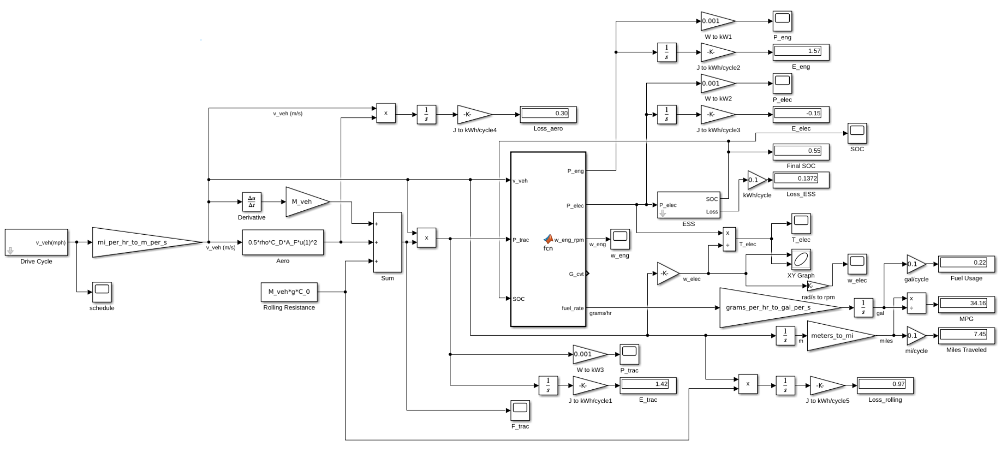
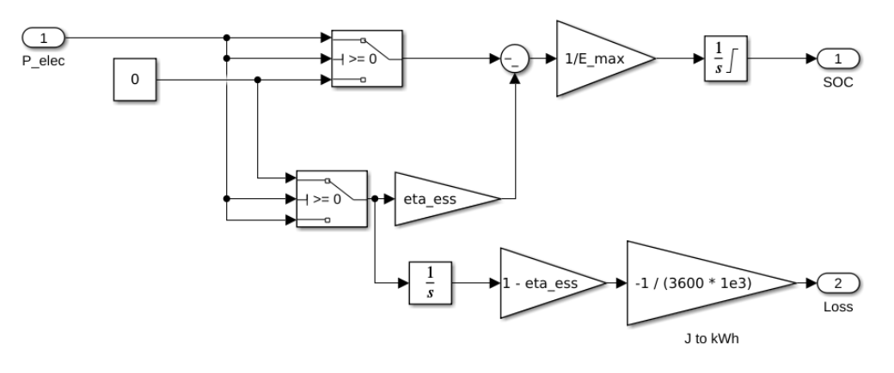
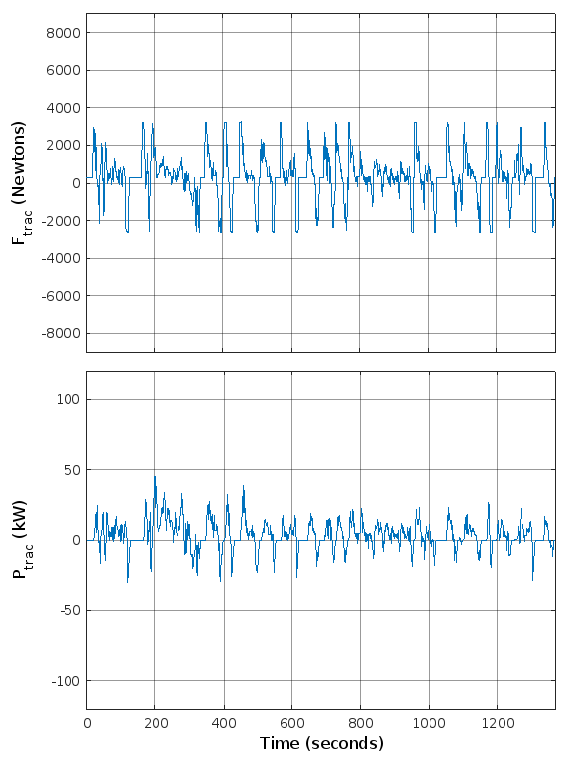
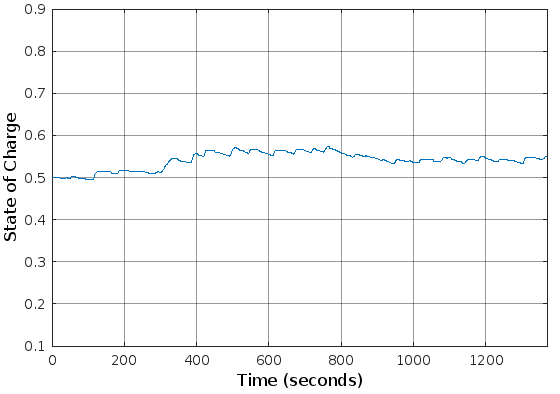
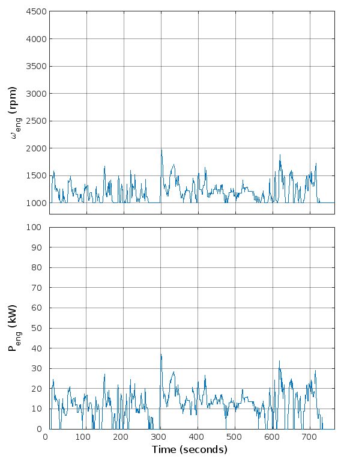
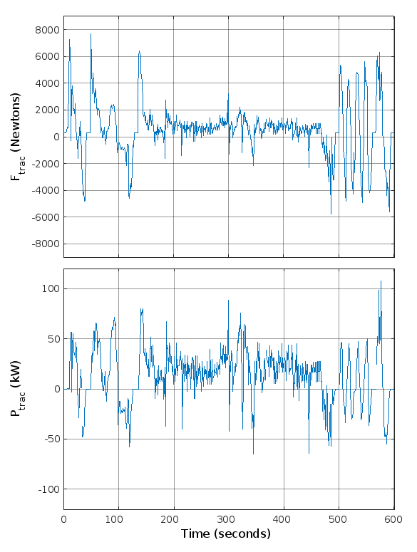
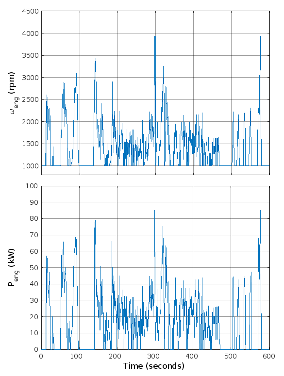

::: twocolumns

# Introduction

Hybrid electric vehicles enable more efficient management of energy used for transporting people and goods, leading to increased fuel efficiency compared to conventional vehicles with only internal combustion engines (ICE) [@Mi.Hybrid.2017]. In this paper, a hybrid electric vehicle is put through several simulated driving conditions and relevant parameters are recorded, such as torque-speed in the electric motor and the flow of power into, through, and out of the system. The overall architecture of this simulated vehicle is given in Figure 1. It is a parallel hybrid vehicle, which means that the ICE is mechanically connected to the wheels, and the electric machine is attached to the same driveshaft.

# Methods

The vehicle and its behavior was analyzed using Simulink. Constants such as "M_veh" or "eta_ess" were initialized using a script given in the appendix. The model used is shown in Figure 2.

![The system architecture of the parallel hybrid electric vehicle. The electric motor/generator is connected to the driveshaft between the continuously variable transmission (CVT) and the differential [@proj1].](figures/sysarch_block.png)

:::

{width=80%}

::: twocolumns

The simulation was performed for three different drive schedules published by the United States EPA: "UDDS" (a typical city drive), "HWFET" (a typical highway drive), and "US06" (an aggressive highway drive). For each drive schedule, ten plots were generated: one showing the drive schedule itself, one showing the torque-speed relationship for the electric machine, and eight others showing how various vehicle parameters varied throughout the drive. In addition, ten physical quantities were calculated for each drive schedule and tabulated in Table 1. Of those quantities, all but the state of charge (SOC) were found by running the simulation for the drive cycle ten times in a row and finding the average value. The SOC value and the plots were generated by running the simulation for a single drive cycle.

# Results & Analysis

## UDDS (City)

![EPA Urban Dynamometer Driving Schedule (UDDS) [@USEPA.Dynamometer.2022].](figures/udds_v.png)

In this drive schedule, frequent stops and starts require the vehicle to accelerate and decelerate quite often. The total tractive force and power requirements for this drive schedule are shown in Figure 5.

The vehicle's gasoline engine speed and power output are shown in Figure 6.

The vehicle's electric machine torque, speed, and power output are shown in Figure 7. The sharp-eyed viewer may notice that the electric machine speed is directly proportional to the vehicle's ground speed (as shown in Figure 4); this is because the electric machine is connected to the driveshaft after the transmission, so the gear ratio never changes.

A torque-speed plot for the vehicle's electric machine is given in Figure 8.

Finally, the state of charge for the energy storage subsystem (ESS), or battery, is shown in Figure 9.

## HWFET (Highway)

![Highway Fuel Economy Driving Schedule (HWFET) [@USEPA.Dynamometer.2022].](figures/hwfet_v.png)

In this drive schedule, most of the journey is spent cruising at relatively consistent high speeds, such that acceleration and deceleration are fairly infrequent. The total tractive force and power requirements for this drive schedule are shown in Figure 11.

The vehicle's gasoline engine speed and power output are shown in Figure 12.

The vehicle's electric machine torque, speed, and power output are shown in Figure 13. As in the UDDS simulation, and for the same reason, the electric machine speed is directly proportional to the vehicle's ground speed (Figure 10).

A torque-speed plot for the vehicle's electric machine is given in Figure 14.

Finally, the state of charge for the ESS is shown in Figure 15.

## US06 (Aggressive Highway)

![US06, a high acceleration aggressive drive schedule [@USEPA.Dynamometer.2022].](figures/us06_v.png)

In this drive schedule, the vehicle experiences both high speeds, reaching up to 80 miles per hour, as well as many instances of rapid acceleration and braking. The total tractive force and power requirements for this drive schedule are shown in Figure 17.

The vehicle's gasoline engine speed and power output are shown in Figure 18.

The vehicle's electric machine torque, speed, and power output are shown in Figure 19. As in the previous simulations, and for the same reason, the electric machine speed is directly proportional to the vehicle's ground speed (Figure 16).

A Torque-speed plot for the vehicle's electric machine is given in Figure 20.

Finally, the state of charge for the ESS in shown in Figure 21.

## Summary of Results

Calculated estimates for various important physical quantities are given in Table 1.

:::

|   **Table 1**    |          |           |          |     |
| :--------------: | :------: | :-------: | :------: | :-- |
|                  | **UDDS** | **HWFET** | **US06** |     |
| Tractive Energy  |   1.42   |   2.34    |   2.34   | kWh |
|  Engine Energy   |   1.57   |   2.39    |   2.56   | kWh |
|    ESS Energy    |  -0.15   |   -0.05   |  -0.22   | kWh |
| Aerodynamic Loss |   0.30   |   0.98    |   1.14   | kWh |
|     ESS Loss     |   0.14   |   0.04    |   0.16   | kWh |
|   Rolling Loss   |   0.97   |   1.33    |   1.04   | kWh |
| Fuel Consumption |   0.22   |   0.33    |   0.28   | gal |
|  Drive Distance  |   7.45   |   10.26   |   8.01   | mi  |
| Fuel Efficiency  |  34.16   |   31.46   |  28.95   | mpg |
|    Final SOC     |   0.55   |   0.55    |   0.66   |     |

::: twocolumns

To provide a few brief sanity checks, the Tractive Energy should be equal to the sum of the Engine Energy and the ESS Energy (e.g. 1.42 = 1.57 - 0.15); this is true for all three drive schedules. In addition, that net total energy should be equal to the sum of losses (e.g. 1.42 = 0.30 + 0.14 + 0.97). This is not quite true, as two of the drive schedules are off by 0.01 kWh, but we can safely treat such small differences as rounding errors, so this is not a cause for concern.

Note that if a drive schedule involved stopping at a different velocity than it started, then these calculations would require taking into account the difference in kinetic energy of the vehicle, too. However, all three drive schedules used in this study began and ended at a complete stop, so that net difference was zero in all cases.

# Discussion

The results discussed in the previous section all fit within reasonable bounds and lead to conclusions that one would expect based on real-world vehicle behavior; figure captions explain the conclusions that one can derive from each associated plot and why they are reasonable for its drive schedule. For example, engine speed ($\omega_{eng}$) stayed at or above a minimum of 1000 rpm, the given idle speed, and even in the most aggressive schedule (US06) it never exceeded its maximum rated speed of 4014 rpm. The brake specific fuel consumption (BSFC) at the typical idle speed of 1000 rpm was somewhat high, as shown in Table 2, reproduced below from @proj1 with some values rounded to have less digits:

:::

| **Table 2** |             |              |
| :---------: | :---------: | :----------: |
| Power (kW)  | Speed (rpm) | BSFC (g/kWh) |
|    7.66     |    1009     |     500      |
|    12.77    |    1183     |     400      |
|    24.64    |    1589     |     320      |
|    35.77    |    1937     |     285      |
|    47.63    |    2318     |     265      |
|    57.30    |    2613     |     255      |
|    77.74    |    3371     |     255      |
|    82.85    |    3685     |     265      |
|    85.58    |    4014     |     285      |

::: twocolumns

However, while BSFC is relatively high at engine idle speed, note that it gives fuel consumption *per kilowatt-hour.* This means that the absolute amount of fuel consumed was quite small, as very little power was actually drawn from the engine while idling. Since this vehicle has a CVT (see Figure 1), it was able to operate at optimal BSFC for any given engine speed.

One interesting result from this study is that the SOC ended up above 0.50 for all drive schedules. In fact, if the simulation is allowed to run through a schedule that uses aggressive regenerative braking (e.g. US06) multiple times in succession, the ESS can end up charged well into the uppermost quarter of its capacity by the end. While this is probably realistic, assuming a fairly simple ESS controller, it also indicates that a more sophisticated power management scheme may be wise. A controller that has a lower threshold for using electric launch and boost as SOC grows higher may provide an elegant solution to this problem, and that could be an interesting topic for future studies.

:::

# Appendix

The following initialization script is reproduced from here from @proj1 for convenience only; no alterations were made from the original.

\begin{lstlisting}[style=Matlab]
clear all
M_glider = 1746;  % glider mass, kg
M_passengers = 180; % driver mass kg
C_D = 0.35;    % drag coefficient
C_0 = 0.015;   % rolling resistance coefficient
A_F = 1.93;    % frontal area, m^2
eta_ess = 0.8; % energy storage subsystem round-trip efficiency
r_wheel = 0.2794; % wheel radius, m
P_eng_min = 5000.0; % min engine power, W
P_eng_max = 85000.0; % max engine power, W
G_diff = 0.268;     % differential gear ratio
w_eng_min_rpm = 1000; % minimum engine speed in rpm
E_batt_kW = 2.0;   % battery capacity, kW
SOC_init = 0.5; % initial SOC
m_batt = 25; % battery mass density, kg/kWh
G_elec = 1; % gear ratio for motor
G_cvt_min = 0.5;

% physical constants
rho = 1.225; % density of air, kg/m^3
g = 9.81; % acceleration due to gravity,  m/s^2

% unit conversions
meters_to_mi = 1/1609; % meters to miles
grams_per_hr_to_gal_per_s = 9.778e-8;  % g/hr to gal/s
mi_per_hr_to_m_per_s = 0.44704; % mi/hr to m/s

% calculated constants

w_eng_min = w_eng_min_rpm * 2 * pi / 60;

v_veh_min = G_cvt_min * G_diff * r_wheel * w_eng_min;  % smallest vehicle speed for engine to stay engaged, in m/s
E_ess_max = E_batt_kW * 1000 * 3600; % energy storage capacity in J
M_batt = m_batt* E_batt_kW; % battery mass in kg
M_veh = M_glider + M_passengers + M_batt;

% load drive cycles and engine map
load hwfet
load ftp75
load us06
load la92
load udds
load wltc

load eng_map

% wrap some parameters into structure "param"
param.v_veh_min = v_veh_min ;
param.P_eng_min = P_eng_min ;
param.P_eng_max = P_eng_max ; 
param.G_cvt_min = G_cvt_min ;
param.G_diff = G_diff ;    
param.r_wheel = r_wheel ;
\end{lstlisting}

The following function is called "fcn" in the Simulink model and is reproduced here from @proj1 for convenience only; no alterations were made from the original.

\begin{lstlisting}[style=Matlab]
function [P_eng, P_elec, w_eng_rpm, G_cvt, fuel_rate] = fcn(v_veh, P_trac, SOC, param, eng_map)
%#codegen
%inputs:
    % v_veh, m/s
    % P_trac, W
    % SOC
    % param, structure of parameters
    % eng_map

% outputs:
    %   P_gen, P_elec in W
    %   w_eng_rpm, rpm
    %   G_cvt (cvt ratio)
    %   Fuel rate, grams/hr

v_veh_min = param.v_veh_min;    % minimum vehicle speed for engine to stay engaged, in m/s
P_eng_min = param.P_eng_min;    % minimum engine power in W
P_eng_max = param.P_eng_max ;   % maximum engine power
G_cvt_min = param.G_cvt_min;    % minimum cvt  ratio
G_diff = param.G_diff;          % differential gear ratio
r_wheel = param.r_wheel;        % wheel radius in m

if (v_veh < v_veh_min)  % disengage clutch, idle engine, electric propulsion
   P_elec = P_trac;
   P_eng = 0;
   fuel_rate = 0; % g/hr;
   w_eng_rpm = 1000; % rpm
   G_cvt = G_cvt_min;
   return  
end

% if here, v_veh > v_veh_min
if(P_trac < P_eng_min)   % clutch engaged but engine idling
   P_elec = P_trac;
   fuel_rate = 0;
   P_eng = 0;
   w_eng_rpm =  1000; % rpm
   w_eng = w_eng_rpm * pi / 30; % rad/s
   % set G_cvt so engine speed is 1000 rpm
   G_cvt = v_veh/G_diff/w_eng/r_wheel;
   return     
end

if(P_trac > P_eng_max) % high-speed boost
   P_elec = P_trac - P_eng_max;
   P_eng = P_eng_max;
   bsfc = interp1(eng_map(:,2), eng_map(:,3), P_eng/1000, 'pchip', 'extrap');
   fuel_rate = bsfc*P_eng/1000; % grams/hr
   w_eng_rpm = interp1(eng_map(:,2), eng_map(:,1), P_eng/1000, 'pchip', 'extrap');
   w_eng = w_eng_rpm * pi / 30; % convert to rad/s
   G_cvt =  v_veh/r_wheel/G_diff/w_eng; % required CVT ratio
   return   
end

% if here, v_veh > v_veh_min and P_eng_min < P_trac < P_eng_max
% try to get SOC back to 0.5

P_elec = 20000*(SOC - 0.5); 
if(P_elec > 4000)
    P_elec = 4000;
end
if(P_elec < -4000)
    P_elec = -4000;
end

P_eng = P_trac - P_elec;

if(P_eng < P_eng_min) 
   % clutch engaged, but no fuel
   P_eng = 0;
   P_elec = P_trac;
   fuel_rate = 0;
   w_eng_rpm = 1000;
   w_eng = w_eng_rpm * 2 * pi / 60; % in rad/s
   % set G_cvt so engine speed is 1000 rpm
   G_cvt = v_veh/G_diff/w_eng/r_wheel;
   return
end

if(P_eng > P_eng_max)
    P_eng = P_eng_max;
    P_elec = P_trac - P_eng_max;
end

bsfc = interp1(eng_map(:,2), eng_map(:,3), P_eng/1000, 'pchip', 'extrap');
fuel_rate = bsfc*P_eng/1000; % grams/hr

w_eng_rpm = interp1(eng_map(:,2), eng_map(:,1), P_eng/1000, 'pchip', 'extrap');
if(w_eng_rpm < 1000)
    w_eng_rpm = 1000;
end
w_eng = w_eng_rpm * pi / 30;  % convert to rad/s
G_cvt =  v_veh/r_wheel/G_diff/w_eng;

if (G_cvt < G_cvt_min) % set G_cvt = G_cvt_min, recalculate w_eng, P_eng, and P_elec
   G_cvt = G_cvt_min;
   w_eng = v_veh/G_diff/r_wheel/G_cvt;
   w_eng_rpm = w_eng*30/pi;  % in rpm
   P_eng = 1000*interp1(eng_map(:,1), eng_map(:,2), w_eng, 'pchip', 'extrap'); % in W
   if(P_eng < 0)
       P_eng = 0;
   end
   P_elec = P_trac - P_eng;
   bsfc = interp1(eng_map(:,1), eng_map(:,3), w_eng, 'pchip', 'extrap');
   fuel_rate = bsfc*P_eng/1000; % grams/hr
 end
\end{lstlisting}

# References