# Introduction

Permanent-magnet (PM) motors using three-phase alternating current (AC) are simple, efficient electric machines used in many different electromechanical systems [@proj2]. This project develops a semi-detailed simulation of a PMAC motor, using both analytically-derived equations for the steady state conditions [@proj2answers] as well as a Simulink model of the same motor.


# Methods

## Task 1 {#sec:methods1}
First, the optimal values for $I_{qs}^r$ and $I_{ds}^r$ were calculated as a function of desired torque, minimizing the total Euclidian current in Park space, constrained to $T_e = \frac{3 P}{4} (\lambda_m I_{qs}^r + (L_d - L_q) I_{qs}^r I_{ds}^r)$. These values were saved so that they could be used for a lookup table in the Simulink model [@proj2]. Code for these calculations is given in @Sec:main.

## Task 2
Next, using the table optimal values calculated previously, the steady-state values of several important quantities ($V_{qs}^r$, $V_{ds}^r$, motor power draw, and battery current) were calculated for a constant mechanical speed of 500 rpm and a desired torque of ±400 N-m. Code for these calculations is shown in @Sec:main.

## Task 3
Finally, a Simulink model was created to simulate the motor drive in accordance with @Fig:block\ [@proj2]. Code for initializing the appropriate variables is shown in @Sec:main, and the Simulink model is pictured in @Fig:Simulink. The interiors of the block components in that model are shown in [@Fig:cc; @Fig:filter; @Fig:modulator; @Fig:inverter; @Fig:PMAC]. Note that the `Ks_(theta_r)` block performs a Park transformation on the inputs to produce the outputs, while `Ks_inverse_(theta_r)` naturally does the inverse, transforming its inputs from Park space to real space.

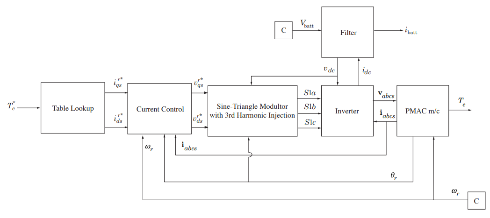{#fig:block}

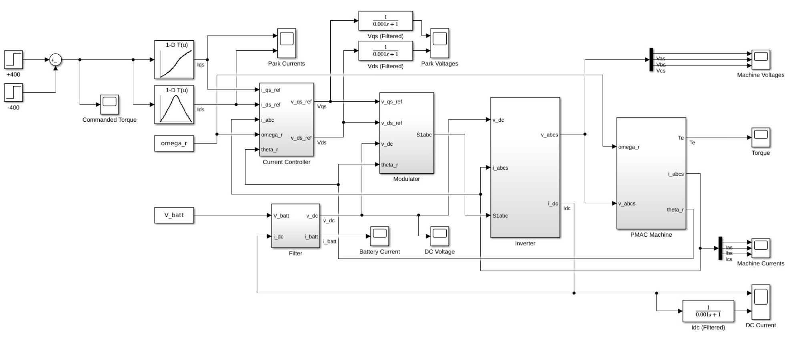{#fig:Simulink}

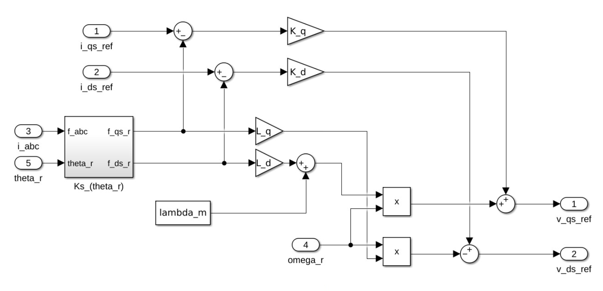{#fig:cc width=5in}

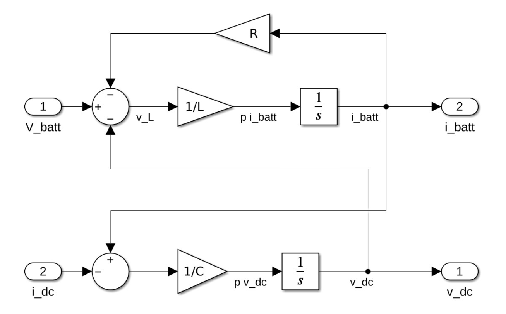{#fig:filter width=4in}

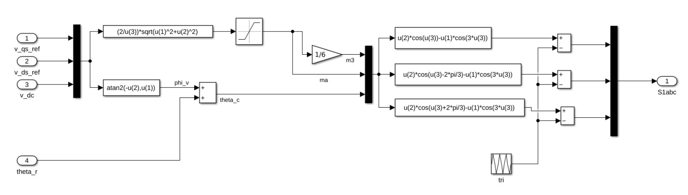{#fig:modulator}

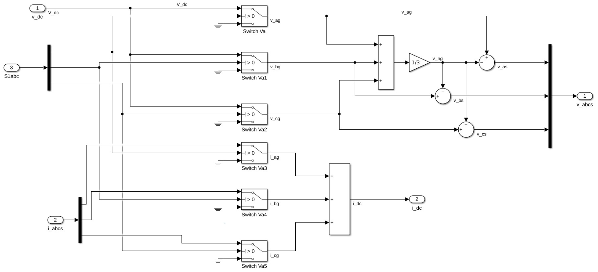{#fig:inverter}

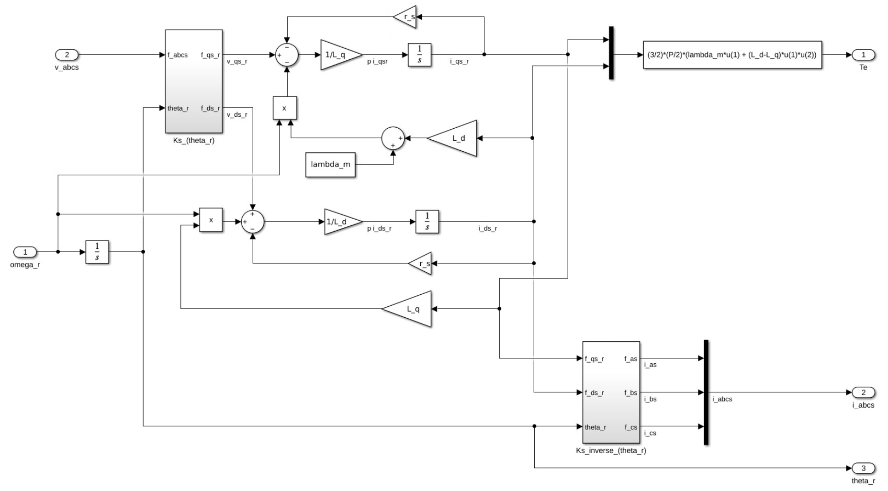{#fig:PMAC}

\clearpage


# Results & Analysis

## Task 1 {#sec:results1}
The optimal values for $I_{qs}^r$ and $I_{ds}^r$ are shown in @Fig:task1. Note from the shape of $I_s$ that the total Euclidian current (in Park space) grows at a decaying rate relative to the total torque input/output. This is expected for the optimal curve of this value, given that torque output is related to the product of $I_{qs}^r$ and $I_{ds}^r$ per the constraints in @Sec:methods1.

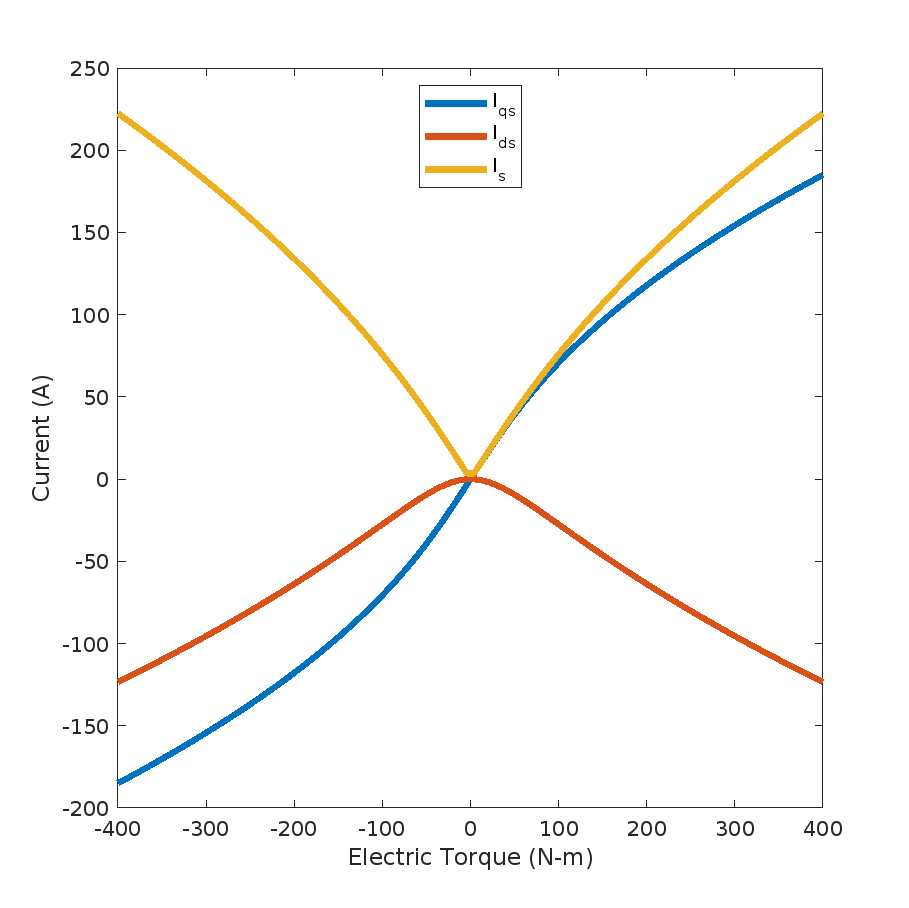{#fig:task1 width=4in}

## Task 2 {#sec:results2}
The calculated values for the Park voltages $V_{qs}^r$, $V_{ds}^r$ and the motor power draw and battery current are recorded in @Tbl:task2. 

|     Quantity     |     Symbol      | Case 1 | Case 2 | Units |
| :--------------: | :-------------: | :----: | :----: | :---- |
|   Rotor Speed    | $\omega_{mech}$ |  500   |  500   | rpm   |
|      Torque      |      $T_e$      |  400   |  -400  | N-m   |
|   Park Current   |   $I_{qs}^r$    |  185   |  -185  | A     |
|   Park Current   |   $I_{ds}^r$    |  -123  |  -123  | A     |
|   Park Voltage   |   $V_{qs}^r$    | -6.10  | -13.5  | V     |
|   Park Voltage   |   $V_{ds}^r$    |  -130  |  125   | V     |
| Motor Power Draw |     $P_{e}$     |  22.4  | -19.5  | kW    |
| Battery Current  |   $I_{batt}$    |  56.1  | -48.7  | A     |

: Calculated steady-state values for the simulated PMAC motor drive. {#tbl:task2}

## Task 3 {#sec:results3}

### Torque
The commanded and simulated output torques are shown in @Fig:torque. After a few milliseconds, the output torque (396 and -395) converges quite close to any commanded values (400 and -400, respectively), albeit slightly smaller due to inefficiencies in the system. This suggests that the system as a whole is a good model, and that the control system works well.

<div id="fig:torque">

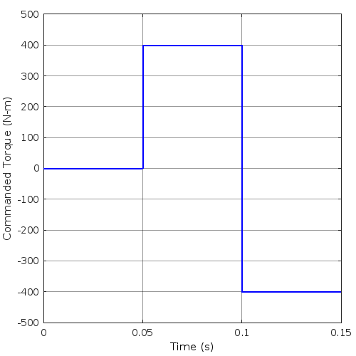{#fig:tStar width=2.5in}
\hspace{5em}
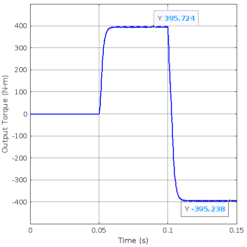{#fig:tReal width=2.5in}

The commanded torque and simulated torque from the Simulink simulation. Comparing the two plots shows how the output torque takes only a few milliseconds to reach the commanded value.

</div>

### Stator Voltages {#sec:voltage}
The machine's three-phase voltage inputs are shown in @Fig:voltage. The blocky appearance is due to the fact that the curves are not true sinusoids, but rather they are switched-power (with harmonic injection); the underlying shape is more apparent in @Fig:voltDetail. The sudden shifts at t=0.05 and t=0.1 seconds are due to the changes in commanded torque, per @fig:tStar.

The machine's input voltages in Park space are shown in @Fig:parkVoltage. While there are large overshoots in the transient response to sudden changes in the commanded torque, both voltages converge on constant values within a few milliseconds.

<div id="fig:voltage">

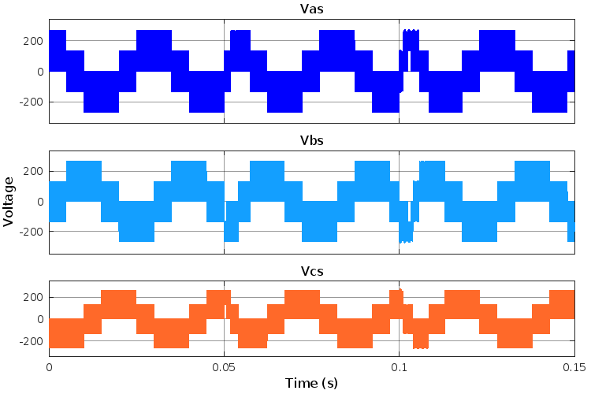{#fig:volt width=4.5in}
\hspace{2em}
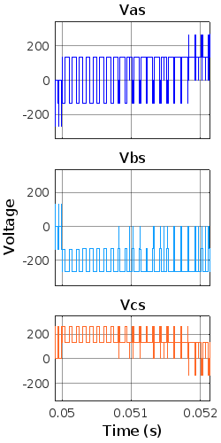{#fig:voltDetail width=1.5in}

PMAC motor drive input voltages. They make up typical three-phase sinusoids, albeit with sudden phase shifts when the commanded torque changes.

</div>

### Stator Currents
The machine's three real input currents are shown in @Fig:current. All three are zero at first, as the commanded torque (and therefore the current consumption) is zero until t=0.05 seconds. At t=0.05 and t=0.1 seconds, there is a sudden appearance and phase shift, respectively, of the three sinusoids. Just as discussed above, this is due to the sudden changes in the commanded torque at those times.

The machine's input currents in Park space are shown in @Fig:parkCurrent. As should be readily apparent, these are much simpler step functions than the balanced sinusoids of real space, which is why the Park transformation is commonly used in the analysis of systems like this.

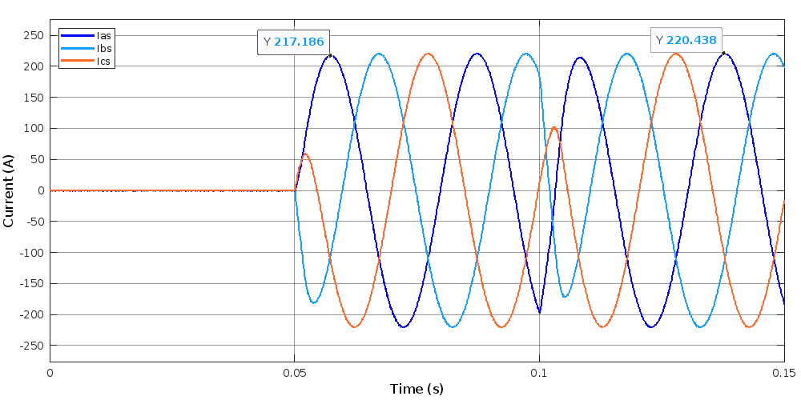{#fig:current}

<div id="fig:park">

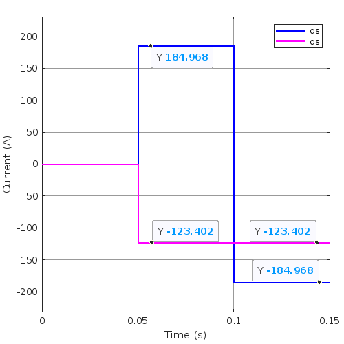{#fig:parkCurrent width=2.5in}
\hspace{5em}
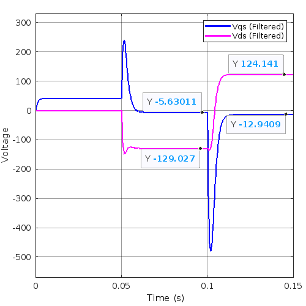{#fig:parkVoltage width=2.5in}

PMAC input voltage and current in Park space. When transformed in this way, the functions are much simpler step inputs rather than complicated sinusoids.

</div>

<div id="fig:dc">

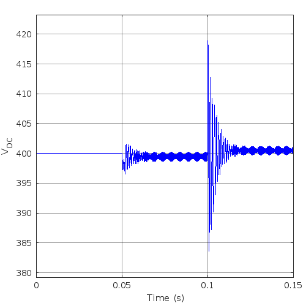{#fig:vdc width=2.5in}
\hspace{2em}
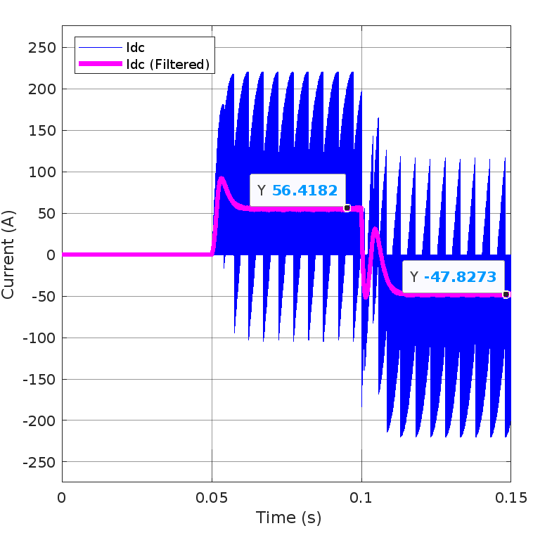{#fig:idc width=2.5in}
\hspace{2em}
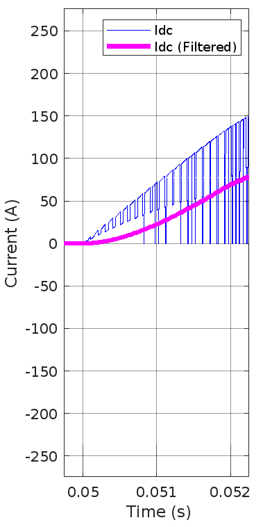{#fig:idcDetail width=1.21in}

The supply voltage remains steady around 400 volts at all times, only deviating during transient oscillations when the commanded torque suddenly changes. The supply current oscillates greatly during operation because it is operating as a switched current supply.

</div>

### Supply Voltage and Current
The battery is kept at a constant 400 volts during this simulation; the DC supply voltage has transient oscillations around that value but never deviates from it for any significant length of time, as shown in @Fig:vdc. The current drawn from the DC supply may appear somewhat erratic upon first glance at @Fig:idc, but the large variations are due to the fact that it is used as a switched supply. Filtering the signal reveals that the overall behavior is much smoother and more predictable, converging to a constant value around when the output torque converges to a constant value. For a slightly better look at the switching characteristics of the current supply, @Fig:idcDetail shows a detailed view of the motor's startup from zero towards a constant positive torque.

### Battery Current
The current output from the battery is shown in @Fig:battery. There are some large oscillations at the sharp transitions in commanded torque at t=0.05 and t=0.1 seconds, but it converges to a constant value within a few milliseconds of each change.

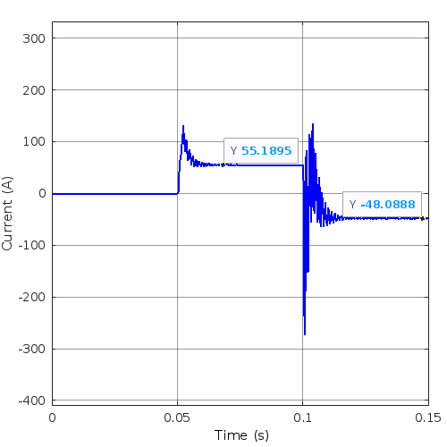{#fig:battery width=3in}

# Discussion

The results discussed in the previous section all fit within reasonable bounds and lead to conclusions that one would expect based on real-world motors; subsections and their associated figure captions explain the conclusions that one can derive from each measurement and why they are reasonable for this kind of system. Importantly, the results for the analytically-predicted steady-state behavior given in @Sec:results2 match well with those found more empirically in the simulated results given in @Sec:results3. @Tbl:plus summarizes the difference between the two methods for commanding +400 N-m torque, while @Tbl:minus summarizes the difference between the two methods for commanding -400 N-m torque. In both cases, both methods' predictions are within a few percent of each other for all values except $V_{qs}^r$. The larger percent difference on that particular value is likely because it is a fairly small number compared to the range of reasonable values for that quantity, so any differences seem much larger in comparison.


|    Quantity     |   Symbol   | Analytical Prediction | Simulated Value | Difference | Difference (%) | Units |
| :-------------: | :--------: | :-------------------: | :-------------: | :--------: | :------------: | :---- |
|     Torque      |   $T_e$    |          400          |      395.7      |    4.3     |     1.08%      | N-m   |
|  Park Voltage   | $V_{qs}^r$ |         -6.10         |      -5.63      |    0.47    |     7.78%      | V     |
|  Park Voltage   | $V_{ds}^r$ |         -130          |      -129       |    1.30    |     1.00%      | V     |
|   Power Draw    |   $P_e$    |         22.43         |      22.32      |    0.11    |     0.47%      | kW    |
| Battery Current | $I_{batt}$ |         56.1          |      55.2       |    0.88    |     1.57%      | A     |

: Differences between the analytical predictions and simulated results for a commanded torque of +400 N-m. {#tbl:plus}

|    Quantity     |   Symbol   | Analytical Prediction | Simulated Value | Difference | Difference (%) | Units |
| :-------------: | :--------: | :-------------------: | :-------------: | :--------: | :------------: | :---- |
|     Torque      |   $T_e$    |         -400          |     -395.2      |    4.8     |     1.20%      | N-m   |
|  Park Voltage   | $V_{qs}^r$ |         -13.5         |      -12.9      |    0.56    |     4.15%      | V     |
|  Park Voltage   | $V_{ds}^r$ |          125          |       124       |    1.23    |     0.98%      | V     |
|   Power Draw    |   $P_e$    |        -19.46         |     -19.39      |    0.07    |     0.37%      | kW    |
| Battery Current | $I_{batt}$ |         -48.7         |      -48.1      |    0.56    |     1.16%      | A     |

: Differences between the analytical predictions and simulated results for a commanded torque of +400 N-m. {#tbl:minus}

Additionally, a simple sanity check is to confirm that the amplitude of the machine's real input currents ($I_{as}$) matches the Euclidean total current in Park space ($\sqrt{(I_{qs}^r)^2 + (I_{ds}^r)^2}$). For the +400 N-m case, $I_{qs}^r$ is 184.97 A and $I_{ds}^r$ is -123.40 A, which adds to a Euclidean total of 222.36 A: a close match to the real input current of 217.19 A. For the -400 N-m case, $I_{qs}^r$ is -184.97 A and $I_{ds}^r$ is -123.40 A, which adds to the same Euclidean total of 222.36 A. This is also quite a close match its own real input current of 220.44 A. The fact that these numbers are nearly equal provides reassurance that the simulation is working properly.

\appendix
# Appendix

## Motor Optimization {#sec:main}
While much of the code below is based on that given in @proj2, there are a few small changes from the source materials to improve the readability and output style.

### `main.m`
``` {#lst:main .matlab .numberLines}
% use interior - point algorithm

% motor parameters
global param
N= 100;
param.P = 8; % number of poles
param.lambda_m = 0.2;  %flux constant V-s/rad
param.r_s = 0.02;  % stator resistance in ohms
param.L_d = 2e-3; %stator inductance in H
param.L_q = 3.3e-3; %stator inductance in H
param.Is_max = 225; % amperes
omega_rm = linspace(0,2000,N)*30/pi; %500 rpm in rad/s
% 
% iqd= zeros(N,2);
 %V_qs = zeros(1,N);
 %V_ds = zeros(1,N);

T_e = linspace(-400,400,N);
options = optimoptions('fmincon','Algorithm','interior-point');
I_qs = zeros(N,1);
I_ds = zeros(N,1);
for i = 1:N
    param.Te = T_e(i);
    iqd = fmincon(@(iqd) myfun(iqd),[0;0],[],[],[],[],[],[],...
    @(iqd) mycon(iqd),options);

    I_qs(i) = iqd(1) ;
    I_ds(i) = iqd(2) ;
end

save I_qs I_qs
save I_ds I_ds
save T_e T_e

%I am doing part 2 here. Just giving the frequency, grabbing the currents
%for T = 400 and -400. Then using the equations to get the rest
omega_r_e = 500*2*pi/60*param.P/2;
outputs = ["Torque", "Iqs", "Ids", "Vqs", "Vds", "kPower", "Ibatt"];

% T = +400 N
a = I_qs(100);
b = I_ds(100);
V_qs = param.r_s * I_qs(100) + omega_r_e * param.L_d * I_ds(100) + omega_r_e * param.lambda_m;
V_ds = param.r_s * I_ds(100) - omega_r_e * param.L_q * I_qs(100);
Power_qd = 3/2 * (V_qs * I_qs(100) + V_ds * I_ds(100));
I_batt = Power_qd / 400;
dictionary(outputs, [400, a, b, V_qs, V_ds, Power_qd/1000, I_batt])

% T = -400 N
a = I_qs(1);
b = I_ds(1);
V_qs_neg = param.r_s * I_qs(1) + omega_r_e * param.L_d * I_ds(1) + omega_r_e * param.lambda_m;
V_ds_neg = param.r_s * I_ds(1) - omega_r_e * param.L_q * I_qs(1);
Power_qd_neg = 3/2 * (V_qs_neg*I_qs(1)+V_ds_neg*I_ds(1));
I_batt_neg = Power_qd_neg / 400;
dictionary(outputs, [-400, a, b, V_qs_neg, V_ds_neg, Power_qd_neg/1000, I_batt_neg])

omega_r = linspace(0,2000,N);
I_s = sqrt((I_qs.^2) + (I_ds.^2));

% preparing the Iqs / Ids / Is curve, to show the optimal value for every T_e
figure(1)
fontsize(gcf,scale=1.2)
plot(T_e, I_qs, 'LineWidth', 3);
hold on;
plot(T_e, I_ds, 'LineWidth', 3);
plot(T_e, I_s,  'LineWidth', 3);
legend('I_{qs}','I_{ds}','I_s', 'Location','north')
title('Optimal Currents vs Torque')
ylabel('Current (A)')
xlabel('Electric Torque (N.m)')
hold off;
```

### `myfun.m`
``` {#lst:myfun .matlab .numberLines}
function y = myfun(iqd)
%global param
% define function to minimize
y = sqrt(iqd(1)^2 + iqd(2)^2) ;
end
```

### `mycon.m`
``` {#lst:mycon .matlab .numberLines}
function [c,ceq] = mycon(iqd)
global param
% define constraints
c = [];
% no inequality constraints
ceq(1) = param.Te - 1.5*(param.P/2)*(param.lambda_m*iqd(1)+(param.L_d-param.L_q)*iqd(1)*iqd(2));
end
```

### `init.m`
``` {#lst:init .matlab .numberLines}
run("main.m")
clear all
% motor parameters
P = 8; % number of poles
lambda_m = 0.2;  %flux constant V-s/rad
r_s = 0.02;  % stator resistance in ohms
L_d =  2e-3; %d-axis inductance in H
L_q =  3.3e-3; %q-axis inductance in H

% Filter parameters
L = 20e-6; % inductance in H
R = 0.01; % resistance in ohms
C = 2e-3; % capacitance in F

V_batt = 400;  % battery voltage

% Current Control gains
K_q = 2; % in ohms
K_d = 2;

% define electrical rotor speed (w_rm = 500 rpm)
omega_r = 500 * 2*pi / 60 * P/2; % rad/s
% load lookup table data
load I_qs
load I_ds
load T_e
```

# References