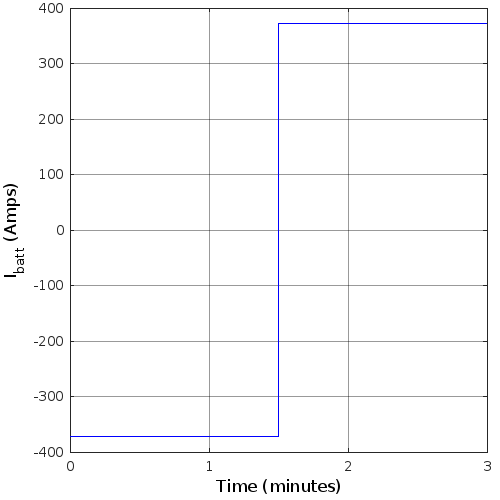

# Introduction {#sec:intro}

Modern electric vehicles rely on lithium-ion (often abbreviated Li-ion or LiPo) battery cells for energy storage, as they are ubiquitous and, compared to conventional battery chemistries, have a relatively high power density for their mass. In previous studies [@proj1submission], an oversimplified constant-voltage source was used to model the behavior of a vehicle's rechargeable battery, but that idealized model fails to capture inefficiencies in the charge and discharge behavior of the device. In this paper, we present a more accurate model for a vehicle battery, consisting of six parallel banks ($N_p = 6$) of one hundred ($N_s = 100$) lithium cells connected in series: a 6p100s battery, in industry parlance. These cells have a 31 Ah capacity [@proj3], and can be modeled as a variable-voltage source (depending on the state of charge) connected in series with a resistor, a resistor and capacitor in parallel, and then the load.


# Methods

## Model
The round-trip efficiency of the battery is modeled according to the block diagram given in [@Fig:model]. The SOC Estimator is a simple Coulomb-counting integrator, the Table Look-up to get the cell's variable-voltage source $V_{oc}$ is a simple linear interpolation of the values given in [@Tbl:soc], and the Cell Circuit Model is a simple set of differential RC circuit equations as described in [@Sec:intro].

{#fig:model width=5in}

|  SoC | $V_{oc}$ |
| ---: | -------: |
| 0.00 |     3.21 |
| 0.10 |     3.27 |
| 0.25 |     3.63 |
| 0.50 |     3.71 |
| 0.75 |     3.93 |
| 0.90 |     4.08 |
| 1.00 |     4.19 |

: Look-up table for the open-circuit voltage of a battery cell as a function of State of Charge (SoC). {#tbl:soc}

\newpage
The Simulink model for the simulation used in this study is shown in [@Fig:simulink]. The interiors of the subsystem blocks within (the Charge/Discharge Schedule, Battery, and Efficiency Calculator) are shown in [@Fig:schedule; @Fig:battery], and [-@Fig:efficiency], respectively. Initialization code, providing reference values for several variables in the model, is given in the appendix.

{#fig:simulink}

{#fig:schedule}

{#fig:battery}

![Interior of the "Cell Model" block shown in [@Fig:battery].](figures/cell.png){#fig:cell width=80%}

{#fig:efficiency}

\newpage
## Charge/Discharge Schedules
Three different charge/discharge schedules were tested with this model. For each case, the battery's overall voltage $V_{batt}$, output current $I_{batt}$, power output $P_{batt}$, and state of charge were plotted over time. In addition, the overall system efficiency, total energy charged, total energy discharged, and total energy lost to resistive heating were recorded for each schedule.

### Slow-Charge, Slow-Discharge
The first scenario tested in this study was that of slowly charging and then slowly discharging. In this case, the battery was initialized with a SoC of 0.2 (that is, charged to 20% of maximum capacity), charged at a C-rate of 0.2 until full, and then discharged at a C-rate of 0.2 until it returned to a SoC of 0.2.

### Fast-Charge, Slow-Discharge
The second scenario tested in this study was that of quickly charging and then slowly discharging. In this case, the battery was initialized with a SoC of 0.2 (as before), charged at a C-rate of 2.0 until full (ten times faster than before!), and then discharged at a C-rate of 0.2 until it reached a SoC of 0.2 (as before).

### Fast-Charge, Fast-Discharge
The third and final scenario tested in this study was that of quickly charging and then quickly discharging a smaller amount of energy. In this case, the battery was initialized with a SoC of 0.5, charged at a C-rate of 2.0 until it reached a SoC of 0.55, and then discharged at a C-rate of 2.0 until it returned to a SoC of 0.5.


# Results & Analysis
## Slow-Charge, Slow-Discharge
The results from simulating the first scenario are summarized in [@Tbl:sch1]. As $E_{charge} = E_{discharge} + E_{loss}$, energy is properly conserved, so we can be assured that the simulation did not erroneously misplace any energy. As expected, the slower input and output of energy in this schedule means that there is relatively little energy lost to resistance in the circuit, so the efficiency is quite high.

|     Quantity      |     Symbol      | Value | Units |
| :---------------: | :-------------: | ----: | :---- |
|    Efficiency     |       ---       | 96.66 | %     |
|  Energy Charged   |  $E_{charge}$   | 58.03 | kWh   |
| Energy Discharged | $E_{discharge}$ | 56.09 | kWh   |
|    Energy Lost    |   $E_{loss}$    |  1.94 | kWh   |

: Results from the first schedule (slow/slow). {#tbl:sch1}

Plots of the battery's overall voltage $V_{batt}$, output current $I_{batt}$, power output $P_{batt}$, and state of charge are shown in [@Fig:vbatt1; @fig:ibatt1; @fig:pbatt1], and [-@fig:soc1], respectively, with further analysis included in their associated captions.

![Battery voltage during the slow-charge, slow-discharge schedule. For a short period before reaching maximum capacity at t = 4 hours, note how the battery voltage exceeded the maximum cell voltage of 420 volts. This occurred because this model does not include any cell-protection features, only a simple constant-current charger. In a real battery, circuitry must be included to ensure that the charger switches to a constant-voltage mode when a constant-current supply would overvolt the battery, as otherwise the battery could be damaged and may explode or catch fire.](figures/1-vbatt.png){#fig:vbatt1 width=3.5in}

{#fig:ibatt1 width=3.5in}

![Battery output power during the slow-charge, slow-discharge schedule. The bends in the power input/output correspond to when the SoC reaches the reference points in [@Tbl:soc].](figures/1-pbatt.png){#fig:pbatt1 width=3.5in}

{#fig:soc1 width=3.5in}

\newpage
## Fast-Charge, Slow-Discharge
The results from simulating the second scenario are summarized in [@Tbl:sch2]. Just as before, $E_{loss}$ is about equal to $E_{charge} - E_{discharge}$, so energy is indeed conserved properly. In comparison to the previous schedule, there is a significant drop in efficiency (over ten percent!): this is due to the additional energy lost to resistance in the circuit, as current is required to flow at higher rates to move charge at the faster scheduled rate.

|     Quantity      |     Symbol      | Value | Units |
| :---------------: | :-------------: | ----: | :---- |
|    Efficiency     |       ---       | 84.04 | %     |
|  Energy Charged   |  $E_{charge}$   | 66.75 | kWh   |
| Energy Discharged | $E_{discharge}$ | 56.10 | kWh   |
|    Energy Lost    |   $E_{loss}$    | 10.67 | kWh   |

: Results from the second schedule (fast/slow). {#tbl:sch2}

Plots of the battery's overall voltage $V_{batt}$, output current $I_{batt}$, power output $P_{batt}$, and state of charge are shown in [@Fig:vbatt2; @fig:ibatt2; @fig:pbatt2], and [-@fig:soc2], respectively, with further analysis included in their associated captions.

![Battery voltage during the fast-charge, slow-discharge schedule. Note how the applied voltage is higher than the maximum cell voltage throughout the entire charging period. This occurs because the extremely high charge rate mandates a high voltage so that a very high current can be pushed into the battery. Just as noted in the caption for [@Fig:vbatt1], this would not happen in a real battery, as this simulation uses an overly simple charger and does not model any cell protection circuitry.](figures/2-vbatt.png){#fig:vbatt2 width=3.5in}

{#fig:ibatt2 width=3.5in}

![Battery output power during the fast-charge, slow-discharge schedule. The bends in the power input/output correspond to when the SoC reaches the reference points in [@Tbl:soc].](figures/2-pbatt.png){#fig:pbatt2 width=3.5in}

![Battery state of charge throughout the fast-charge, slow-discharge schedule. As noted in the caption for [@Fig:soc1], each leg is straight due to the constant rate of charge and discharge in the schedule, but in this case the first slope is much steeper because the charge rate is much faster than the discharge rate.](figures/2-soc.png){#fig:soc2 width=3.5in}

\newpage
## Fast-Charge, Fast-Discharge
The results from simulating the third scenario are summarized in [@Tbl:sch3]. As before, we can successfully confirm the conservation of energy by checking that $E_{charge}$ is about equal to $E_{discharge} + E_{loss}$. In this case, we can see that efficiency has taken an even larger hit compared to the first scenario (around 25% worse!) than even the second schedule did. This was expected, as this aggressive charge/discharge schedule requires the battery to take in and output charge at high rates in both directions, leading to large resistive losses.

|     Quantity      |     Symbol      | Value | Units |
| :---------------: | :-------------: | ----: | :---- |
|    Efficiency     |       ---       | 72.32 | %     |
|  Energy Charged   |  $E_{charge}$   | 4.076 | kWh   |
| Energy Discharged | $E_{discharge}$ | 2.948 | kWh   |
|    Energy Lost    |   $E_{loss}$    | 1.143 | kWh   |

: Results from the third schedule (fast/fast). {#tbl:sch3}

Plots of the battery's overall voltage $V_{batt}$, output current $I_{batt}$, power output $P_{batt}$, and state of charge are shown in [@Fig:vbatt3; @fig:ibatt3; @fig:pbatt3], and [-@fig:soc3], respectively, with further analysis included in their associated captions.

\clearpage
![Battery voltage during the fast-charge, fast-discharge schedule. Note how the applied voltage is higher than the maximum cell voltage throughout the entire charging period, just as it was in [@Fig:vbatt2]. However, this plot also shows an output voltage lower than the minimum cell voltage during the discharging period: this is because the demanded discharge rate is so much higher than in the other schedules. This is not actually as unrealistic as it may first appear; this droop in voltage is due to trying to draw more power from the battery than it is capable of doing efficiently, so the "apparent" voltage (as seen by the load) is lower than what the battery can output at this SoC when less current is required. A properly designed system would need to ensure that it does not run into brown-out errors during any surges in power draw like this.](figures/3-vbatt.png){#fig:vbatt3 width=3.5in}

{#fig:ibatt3 width=3.5in}

{#fig:pbatt3 width=3.5in}

{#fig:soc3 width=3.5in}


\newpage
# Discussion

The results discussed in the previous section all fit within reasonable bounds and lead to conclusions that one would expect of lithium batteries; the tables and figures for each charge/discharge schedule explain the conclusions that one can derive from each measurement and why they are reasonable for this kind of system.

However, for a final set of error checks, one can see if the plotted battery power output matches what should be expected based on the plotted voltage and current. The table below summarizes this verification; the fact that these numbers are nearly equal provides reassurance that the simulation is working properly.

| Schedule |      Time       | $V_{batt}$ (plot) | $I_{batt}$ (plot) | $P_{batt}$ (calculated) | $P_{batt}$ (plot) |
| :------: | :-------------: | :---------------: | :---------------: | :---------------------: | :---------------: |
|    1     |  Charge Start   |        368        |        -37        |          -13.6          |        -14        |
|          |   Charge End    |        425        |        -37        |          -15.7          |        -16        |
|          | Discharge Start |        412        |        37         |          15.2           |        15         |
|          |  Discharge End  |        355        |        37         |          13.1           |        13         |
|    2     |  Charge Start   |        430        |       -370        |          -159           |       -160        |
|          |   Charge End    |        485        |       -370        |          -179           |       -175        |
|          | Discharge Start |        415        |        37         |          15.3           |        15         |
|          |  Discharge End  |        355        |        37         |          13.1           |        15         |
|    3     |  Charge Start   |        435        |       -370        |          -161           |       -160        |
|          |   Charge End    |        440        |       -370        |          -163           |       -160        |
|          | Discharge Start |        330        |        370        |           122           |        120        |
|          |  Discharge End  |        310        |        370        |           115           |        115        |

: A comparison between the value of $P_{batt}$, as estimated by reading [@Fig:pbatt1; @fig:pbatt2; @fig:pbatt3] (rightmost column), and the value of $P_{batt}$ if calculated by multiplying the values of $V_{batt}$ (as estimated by reading [@Fig:vbatt1; @Fig:vbatt2; @Fig:vbatt3]) and $I_{batt}$ (as estimated by reading [@Fig:ibatt1; @Fig:ibatt2; @Fig:ibatt3]) and converting to kilowatts (second to rightmost column). As the two numbers are quite similar for each time point, this verifies that the simulation is calculating power correctly.


\clearpage
\appendix
# Appendix

### `init.m`
``` {#lst:init .matlab .numberLines}
% Cell parameters
Capacity = 31; % Ampere-hours
Q_cell = Capacity*3600; % cell capacity in Coulombs

% R0 resistance 
R0 = 0.009;

% R1 Resistance
R1 = 0.0015; %Ohms

% C1 Capacitance 
C1 = 3.5e4; %Farads

Ns = 100;  % Number of series cells
Np = 6;   % Number of parallel cells

% set simulation conditions
SOC_init = 0.5;
SOC_max = 0.55;
SOC_min = 0.5; % a.k.a. SOC_final; must be <= SOC_init
c_rate_charge = 2.0;
c_rate_discharge = 2.0;
```

# References