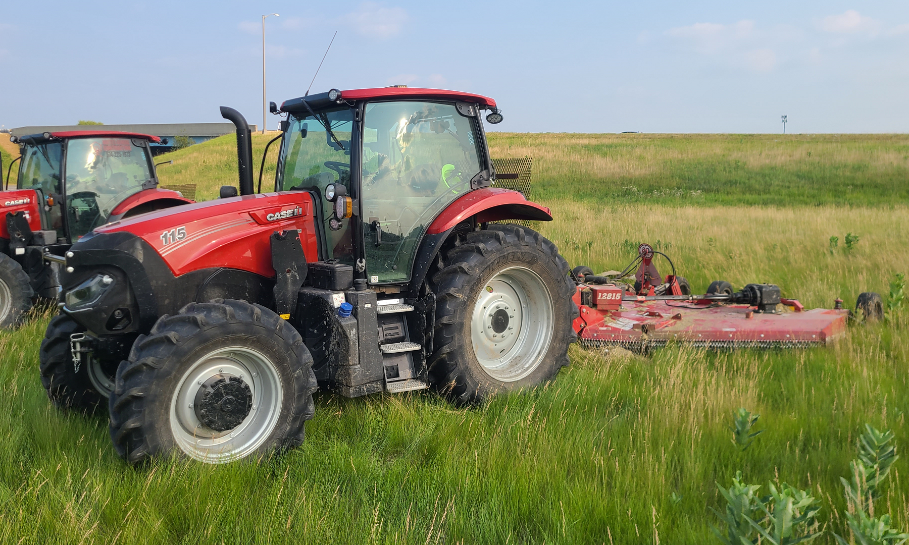
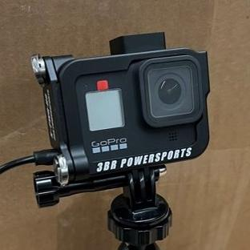
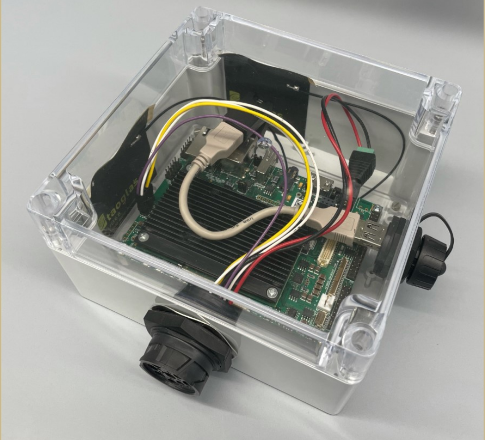

# Introduction & Related Work
Visual odometry, estimating the speed of objects from photographic images, is a classic computer vision challenge. A common formulation of this problem is in estimating the speed of vehicles on a road. However, while the task is well-characterized in several forms [@FernandezLlorca_VisionBasedVehicle_2021], most of these focus on detecting the speed of *other* vehicles on the road, either by stationary traffic cameras [@Bell_AccurateVehicleSpeed_2020] or by onboard driver-assist-type systems [@GarciaAguilar_DetectionDangerouslyApproaching_2024]. Using an onboard camera to detect the vehicle's *own* ground speed is a less common goal, since most relevant systems would have access to the output of an odometer or speedometer that can directly measure the ground speed. In this study, the aim is to estimate the speed of the vehicle solely from its own onboard camera; it assumes that telematics (including recorded speedometer data) are unavailable. Additionally, this system works on low-frequency video, timelapses recorded with a full second of delay between subsequent frames.

This task and associated constraints were chosen in order to support an existing research project. The Evans Lab at Purdue University is studying roadside mowing practices in the state of Indiana. As part of this research, many hours of both telematics data and timelapse video were recorded from tractors towing mowers along Indiana roadways. However, there exist gaps in the data sets for both modalities; being able to accurately extract a vehicle speed from video records would allow portions without accompanying telematics information to partially replace the missing telematics data.

This problem is significant because it advances the science of fusing multimodal data sources in a physical environment, and, assuming the artificial intelligence's speed estimates prove to be reliable and accurate, because it allows the original research dataset to be retroactively expanded to cover more operations. While there exist some methods for estimating vehicle velocity from video input [@Marban_EstimatingPositionVelocity_2017], they typically either rely on grounded external cameras [@Bell_AccurateVehicleSpeed_2020] or estimate only the relative velocity of other vehicles [@GarciaAguilar_DetectionDangerouslyApproaching_2024], rather than the ground velocity of the vehicle carrying the camera itself. In addition, there is novelty in the fact that this project aims to use *timelapse* video, rather than conventional video; since timelapses capture images across longer periods, these kinds of videos are working with information that is more temporally sparse than in conventional videos by at least an order of magnitude. Timelapse imagery has been used in some existing studies [@Hendrickx_AiBasedTracking_2024], but not applied to active vehicles as in this study.

# Methods
## Data Sources
Data used in this study was collected from roadside mowing operations in the summer of 2024. The tractors used consisted of Maxxum 115 and 125 tractors (Case IH, Racine, WI). Towed mowers were all various models of flex-wing rotary cutters 15 feet in width (Brush Hog, Selma, AL). All mowing operations were performed by INDOT contractors with privately owned equipment, as shown in @Fig:mower.

{#fig:mower width=4in}

Timelapse videos were recorded using a Hero 8 Black action-sports camera (GoPro, San Mateo, CA). Cameras were mounted in rugged metal motorsports frames, as shown in @Fig:camera. These systems were flashed with an experimental firmware [@Newman_GoproLabs_2024] that allows recordings to be triggered programmatically in response to different conditions. GPS metadata was extracted from video timelapses using an open-source python program [@Casillas_Gopro2gpx_2023]. Videos were recorded at a sample rate of 1\ Hz and were triggered to record automatically whenever the camera detected the tractor to be powered on and moving.

{#fig:camera width=2in}

Telematics were logged using a Purdue ISOBlue system [@Balmos_IsoblueAvenaFramework_2022], shown in @Fig:ISOBlue. These systems record all messages on the tractor's internal controller area network (CAN), time and location as received from GPS, and have the capability to be remotely accessed over a cellular data connection. These devices were chosen because they are open-source [@OatsCenter_IsoblueHardwareAvena_2023] and technical support was readily available from local colleagues. Logged data was stored in three SQL tables; one for GPS data, one for CAN data, and one for cellular data. The GPS table contains columns for timestamps, latitude, and longitude. The CAN table contains columns for timestamps, network interface, message ID, and message data. Vehicle ground speed was taken from CAN messages and cross-referenced with GPS data for validation.

{#fig:ISOBlue width=2.5in}


## Machine Learning {#sec:ml}
The general architecture of the machine learning network trained in this study is shown in @Fig:arch. A notable piece of preprocessing applied to the data was the extraction of depth information with the pre-trained Depth Anything v2 model [@Yang_DepthAnythingV2_2024], shown in grey in the figure. This mimicked the use of a stereo depth camera, commonly used in robotics and autonomous vehicles, without requiring such a camera system to be deployed in the field. The depth information was added as an additional color channel to the images before being processed by the visual odometry model; the Depth Anything model was used solely in inference mode and not re-trained during the learning process.

{#fig:arch width=6.5in}

After being combined with depth information, images were resized to 256 pixels square, to enforce uniform input and to decrease computational load. Three convolutional neural networks (CNNs) were used in the initial stage of the model. The first was followed by an average pooling stage with a 2x2 kernel, combining spatial features from across the image and reducing the resolution to 128 pixels square. The second was followed by a maximum pooling stage with a 4x4 kernel, extracting all the most prominent features and reducing resolution to 32 pixels square. The third and final CNN layer was followed by an average pooling stage with a 2x2 kernel, condensing the information to 16 pixels square.

After the CNN layers, a Long Short-Term Memory recurrent neural network (LSTM) was used to capture temporal information from successive frames. The LSTM used in this model had eight nodes with four hidden layers, and was only used in unidirectional mode as vehicle speed requires no foreknowledge to measure.

Two layers of fully-connected nets were used to after the LSTM output to condense the information down to a single number for each input frame. Velocities were measured in the meters per second. Ground-truth data for supervised training was taken from telematics measurements, and recorded in rolling averages across 60 second intervals to reduce noise and provide more stable targets for the model to converge on.

The full program developed for this experiment is given in the appendix, @sec:code.

# Results
After training on 24400 frames of timelapse video (corresponding to about 6.8 hours of mowing operations), the model was evaluated against 4180 frames of new data (about 1.2 hours of mowing operations). For the evaluation dataset, the mean average percent error (MAPE) of the model's predicted speeds was 37.25%. Mean average percent error is given by the following equation:

$$ \text{MAPE} = \left|\dfrac{y_{pred} - y_{true}}{y_{true}}\right| $$

Therefore, a MAPE of 37.25% shows that the technology has promise, but this model cannot provide high-confidence predictions of precise vehicle speeds. For example, a predicted speed of 10 m/s (~22 mph) could match a true speed of as low as 6.3 m/s (~14 mph) or as high as 13.7 m/s (~31 mph).

# Discussion
The results show that the trained model has value, but is of limited precision. The trained model could be used to estimate the general activity of the monitored tractor; the model is sufficiently accurate to classify which periods contain low-speed or high-speed motion. If quantitative odometry is required, the MAPE can be used to provide a confidence interval for the estimated speed.

Several possible flaws in the system could be remedied in future development. One likely source of error in the model is the motion of other vehicles in the frame. A pre-trained object identification model could be a simple and effective solution to this issue, to give the model additional information about what objects are in the frame and whether they are likely to be stationary between frames. Such an extension could be added in similar fashion to the depth information that was explained in @Sec:ml.

Another future improvement could be found in streamlining the training process. The data loading system calculated the depth frames on-demand, which seemed to introduce a significant bottleneck to the program. Rewriting the data loader to pre-process the videos in parallel may significantly speed up performance, allowing the model to be trained more quickly and/or with more data.

\clearpage
# References
<div id="refs"></div>

\clearpage \appendix
# Program Code {#sec:code}
```python
!include code/train.py
```
