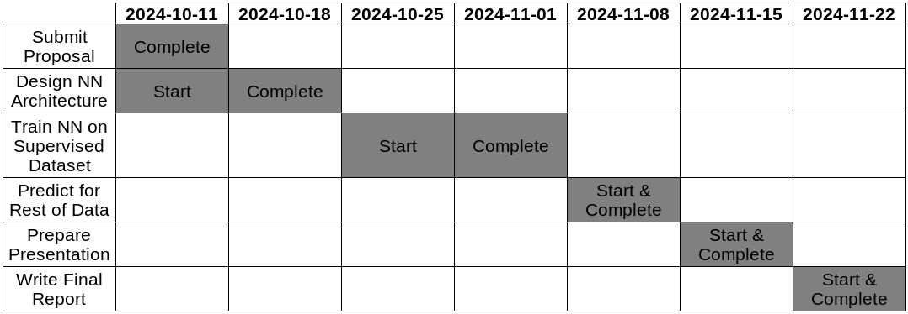

\doublespacing
# Problem Description
The author has a research dataset that has sparse patches from different sensor modalities, and it is desired to fuse the multiple data sources to help answer questions about the dataset as a whole. As a result, this project will attempt to use one sensor modality (timelapse video) to estimate a value that is given by another sensor modality (GPS movement). The input dataset will consist of a timelapse video (frames recorded at 1\ Hz) from a camera mounted to the windshield of a tractor towing a mower attachment. The output labels will be the average ground speed of the tractor at each point in time, with ground truth data calculated from the GPS positions reported over time by an agricultural telematics logger that operated concurrently in some of the monitored tractors. The solution proposed in this project is based on existing techniques, though it is being used to address a novel and significant challenge in the application of computer vision.

This problem is significant because it advances the science of fusing multimodal data sources in a physical environment, and, assuming the artificial intelligence's speed estimates prove to be reliable and accurate, because it allows the original research dataset to be retroactively expanded to cover more operations. While there exist some methods for estimating vehicle velocity from video input [@Marban_EstimatingPositionVelocity_2017], they typically rely on grounded external cameras [@Bell_AccurateVehicleSpeed_2020] or they estimate only the relative velocity of other vehicles [@GarciaAguilar_DetectionDangerouslyApproaching_2024], rather than the ground velocity of the vehicle carrying the camera itself. In addition, there is novelty in the fact that this project aims to use *timelapse* video, rather than conventional video; since timelapses capture images across longer periods, these kinds of videos are working with information that is more temporally sparse than in conventional videos by a factor of at least 24. Timelapse imagery has been used in some existing studies [@Hendrickx_AiBasedTracking_2024], but not applied to active vehicles as in this study.

# AI Methods
The proposed methods for this project include Deep Learning, Convolutional Neural Networks (CNNs), and Long Short-Term Memory recurrent neural networks (LSTMs). Deep Learning was chosen because it allows combining multiple types of neural networks (like CNNs and LSTMs), and it can automatically learn features of a complex dataset like video in a way that would be much more difficult for humans to manually design. CNNs were chosen because they allow the model to combine information gathered from wider areas of the frame, enabling larger motion patterns to be detected. LSTMs were chosen because they allow the model to combine information from previous frames, as a temporal dimension is necessary for detecting speed. While these methods may be computationally intensive, a properly architected model should still be within the capabilities of the hardware available to the author. If the completed model ends up too inefficient, then the input video can be downsampled to lower resolutions in order to reduce computational requirements and increase processing speed.

# Prior Work
Estimating the speed of a vehicle from video footage is a well-characterized problem in several applications [@FernandezLlorca_VisionBasedVehicle_2021]. However, most of these focus on detecting the speed of *other* vehicles on the road, either by stationary traffic cameras [@Bell_AccurateVehicleSpeed_2020] or by onboard driver-assist-type systems [@GarciaAguilar_DetectionDangerouslyApproaching_2024]. Using an onboard camera to detect the vehicle's *own* ground speed is a less common goal, since most relevant systems would have access to the output of an odometer or speedometer that can directly measure the ground speed. However, since this project assumes that telematics (including recorded speedometer data) are unavailable, velocity must be estimated from other data sources (namely, vision).

This type of problem is referred to as "visual odometry" and there exist some approaches to it in classical computer vision [@Nister_VisualOdometryGround_2006; @Howard_RealTimeStereo_2008]. However, these often rely on stereo cameras for depth estimation [@Howard_RealTimeStereo_2008], while only monocular video exists for the research dataset considered here. Perhaps more relevantly, none of these methods use artificial intelligence and so are unfit for this task by default. However, the general approaches described by classical vision algorithms may prove useful for this project; one review [@Aqel_ReviewVisualOdometry_2016] explains the two main classical approaches to this task: one feature-based and one appearance-based method. The feature-based method involves extracting image features, matching them in each frame, and estimating motion from their relative movements. The appearance-based approach, on the other hand, directly estimates speed from the images themselves, using either optical-flow or template-matching algorithms. The literature notes that appearance-based approaches are more suitable for low-texture environments such as soil, asphalt, and concrete [@Aqel_ReviewVisualOdometry_2016], so an AI-based method that acts in similar fashion is recommended for the roadside mowing dataset being studied in this project.

# Deliverables
The deliverables for this project are threefold: first, a python program that performs supervised training on a properly architected neural network (that uses CNNs and LSTMs for deep learning) on an appropriate dataset. Second, an exported set of fully-trained weights for that model, which allow predicting results on new data. Third, the results of applying the fully-trained model on the gaps in the author's research dataset; these may be summarized into graphs of tractor speeds over time, and the accuracy of the predicted speeds should be calculated based on any periods when GPS data was available for comparison.

# Feasibility
The project's proposed timeline is shown in the Gantt chart below.

{#fig:gantt width=6.5in}

\clearpage
# References
